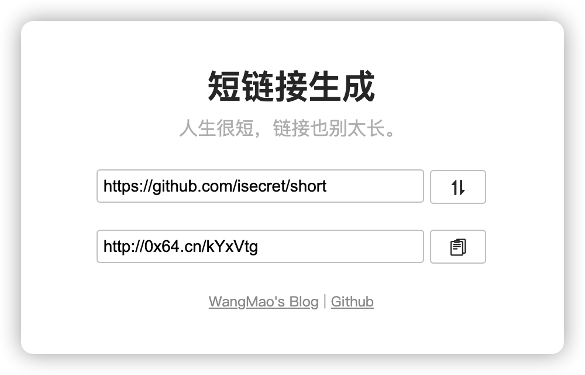

## 短链接生成

又一个基于 PHP 简单实现的短链接在线生成工具，简单配置，快速搭建。



## 快速配置

### 安装
#### 1. 下载源码，部署至服务器，环境 `PHP > 5.6`，需安装 `PDO` 扩展。
#### 2. 配置 Nginx，参考如下：
```conf
server {
    listen  80;
    server_name  url.local;
    root   /www/url;
    index  index.php index.html index.htm;
    
    access_log /dev/null;
    error_log  /var/log/nginx/nginx.url.error.log  warn;

    # 伪静态 必须
    location / {
        try_files $uri $uri/ /index.php?$query_string;
    }

    # sqlite 数据库文件禁止访问 必须
    location ~ /(data\.db) {
        deny all;
    }

    location ~ \.php$ {
        fastcgi_pass   unix:/dev/shm/php-cgi.sock;
        include        fastcgi-php.conf;
        include        fastcgi_params;
    }
}
```
#### 3. 配置数据库，支持 MySQL 和 SQLite。

##### 3.1 MySQL 配置

###### 3.1.1 编辑 index.php

```
<?php
// 数据库连接字符串 host 主机名; dbname 数据库名; charset 字符集编码
define('DB_DSN', 'mysql:host=mysql5;dbname=short;charset=utf8mb4');

// 数据库用户名
define('DB_USER', 'root');

// 数据库密码
define('DB_PASSWD', '123456');
```

###### 3.1.2 导入数据库表结构
使用工具（Navicat、PHPMyAdmin等）连接 MySQL 服务，创建数据库 `short`，并导入 `mysql.db.sql`

##### 3.2 SQLite 配置：

###### 3.2.1 编辑 index.php

```
<?php
// 数据库连接字符串 host 主机名; dbname 数据库名; charset 字符集编码
define('DB_DSN', 'sqlite:data.db');

// 数据库用户名
define('DB_USER', null);

// 数据库密码
define('DB_PASSWD', null);
```

###### 3.2.2 创建数据库文件
复制 `sqlite.db.exp` 为 `data.db`

### 4 配置短链接字符长度

```php
// 生成短链接随机字符长度 默认 6 位 不超过 32 位
define('CODE_LENGTH', 6);
```

## TODO List
- 后台管理
- 域名黑名单
- 密码访问